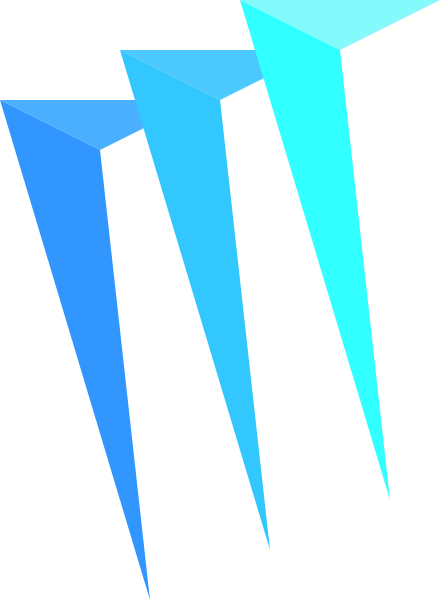

  
  <h1>og.mrcai.dev</h1>
  
Og Image Generator

  

    <strong>
      <a
        href="https://og.mrcai.dev"
        target="_blank"
        rel="noreferrer"
        hreflang="en"
      >
        🔍 Visit Now 🚀
      </a>
    </strong>
  

## ✨ Introduction

An API endpoint to generate custom og images.

## 🧰 Built With

## 📜 License

[MIT](LICENSE)
